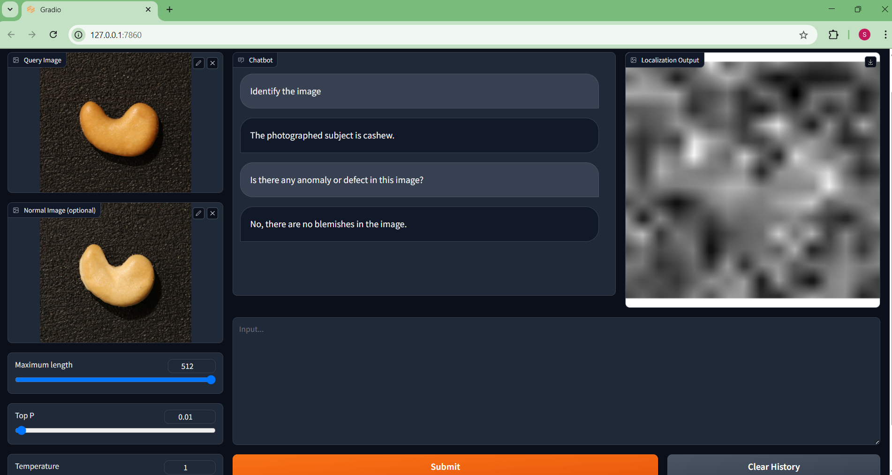
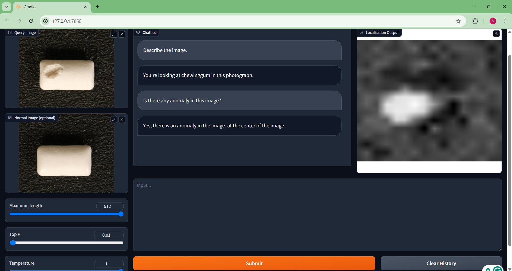
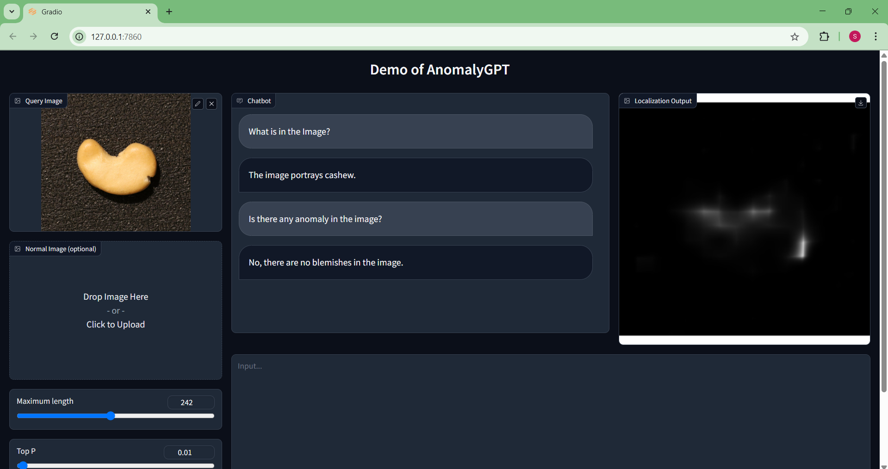
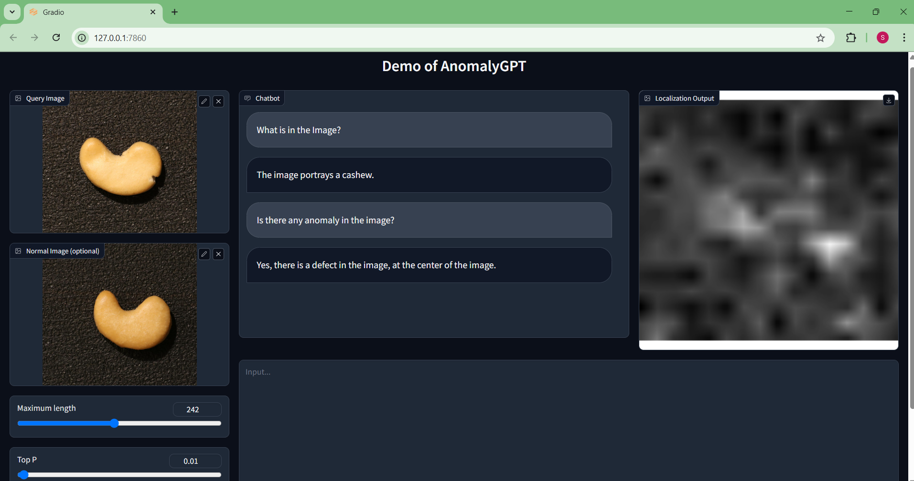
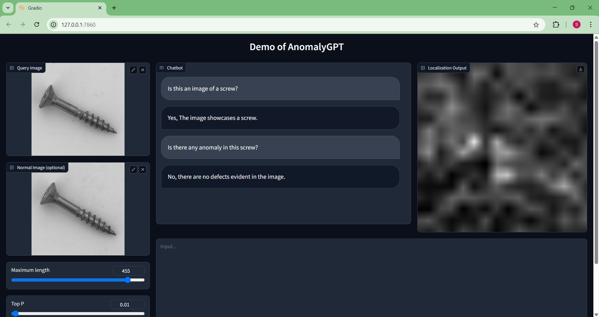

# AnomalyGPT

## 🧾 Table of Contents
- [Overview](#overview)
- [Getting Started](#getting-started)
  - [1. Virtual Machine Setup (Recommended)](#1-virtual-machine-setup-recommended)
  - [2. Code Reproduction Process](#2-code-reproduction-process)
  - [3. Benchmarking Procedure](#3-benchmarking-procedure)
- [Demonstration](#demonstration)

## Overview

AnomalyGPT is a large vision-language model (LVLM) framework designed for industrial anomaly detection, combining the interpretability of natural language with powerful visual reasoning. Built on top of pretrained components such as ImageBind, Vicuna-7B, and PandaGPT, AnomalyGPT can detect and localize visual defects in manufacturing objects using both textual prompts and support images.

Unlike traditional anomaly detectors that rely on handcrafted features or dense patch comparisons, AnomalyGPT leverages the strengths of Large Language Models (LLMs) to generate natural language justifications and detailed pixel-level anomaly maps.

This repository contains:
- Setting up the Virtual Machine on Google Cloud Console (recommended if your OS RAM is less than 32 GB)
- Reproduced evaluation pipelines for MVTec-AD and VisA datasets
- Benchmarking procedure for zero-, one-, and two-shot settings

## Getting Started

### 1. Virtual Machine Setup (Recommended)

Follow these steps to configure a GCP VM (recommended if your system has <32GB RAM):

(i) Use a valid Google account and ensure at least **$150 in credits** with **GPU quota**

(ii) Go to **Compute Engine → VM Instances**. 

(iii) Create a new instance with:  

 - **GPU:** NVIDIA L4  
 - **Machine type:** g2-standard-8 (8 vCPU, 32GB RAM) or higher 
 - **Image:** *Deep Learning VM with CUDA 11.8 (M126)* 

(iv) The region should be selected accordingly based on this <a href="https://cloud.google.com/compute/docs/gpus/gpu-regions-zones">link</a> 

(v) Accept the NVIDIA driver installation prompt with `"yes"`. 

In order to integrate the SSH terminal into the VS Code, watch this video - [https://youtu.be/Cb13DAB59Po?si=30gMQu1rhx4gn7LO] 

### 2. Code Reproduction Process

Clone the repository locally:

<pre> git clone https://github.com/Sounak-131/AnomalyGPT.git </pre>
Set up a Virtual Environment:

<pre>python3.10 -m venv venv </pre>

Then on Windows:

<pre>venv\Scripts\activate</pre>

Or on MacOS/Linux/WSL2:

<pre>source venv/bin/activate</pre>

Install the required dependencies:

<pre>pip install -r requirements.txt</pre>

Afterwards, download the following pretrained checkpoints and place it in respective directories:

<a href="https://dl.fbaipublicfiles.com/imagebind/imagebind_huge.pth">ImageBind Huge</a>, place it on <pre>./pretrained_ckpt/imagebind_ckpt/</pre>

<a href="https://storage.googleapis.com/vicuna-delta-bucket/vicuna-7b-final.zip">Vicuna-7B</a>, unzip it and place it on <pre>./pretrained_ckpt/</pre>

<a href="https://huggingface.co/openllmplayground/pandagpt_7b_max_len_1024/resolve/main/pytorch_model.pt?download=true">Panda GPT<a>, place it on <pre>./pretrained_ckpt/pandagpt_ckpt/7b/</pre>

<a href="https://huggingface.co/FantasticGNU/AnomalyGPT/resolve/main/train_mvtec/pytorch_model.pt">Unsupervised on MVTec-AD<a>, place it on <pre>./code/ckpt/train_mvtec</pre>

<a href="https://huggingface.co/FantasticGNU/AnomalyGPT/resolve/main/train_visa/pytorch_model.pt">Unsupervised on VisA<a>, place it on <pre>./code/ckpt/train_visa</pre>

<a href="https://huggingface.co/FantasticGNU/AnomalyGPT/resolve/main/train_supervised/pytorch_model.pt">Supervised on MVTec-AD, VisA<a>, place it on <pre>./code/ckpt/train_supervised</pre>

Download the MVTec-AD dataset and place it on <pre>./data/</pre> Make sure you rename the folder to <b>mvtec_anomaly_detection</b>

Download the VisA dataset and place it on <pre>./data/</pre> After extracting all of the folders, put all of them together in a folder named <b>VisA</b>

<a href="https://huggingface.co/datasets/openllmplayground/pandagpt_visual_instruction_dataset/resolve/main/pandagpt4_visual_instruction_data.json?download=true">Pretrained PandaGPT</a>, place it on <pre>./data/</pre>

Foe training the model or changing the parameters from 7B to 13B, click on this <a href="https://github.com/CASIA-IVA-Lab/AnomalyGPT?tab=readme-ov-file">link</a>

Optional: Increase VM Swap Memory
If your swap shows zero (free -h), run:
<pre>sudo fallocate -l 16G /swapfile
sudo chmod 600 /swapfile
sudo mkswap /swapfile
sudo swapon /swapfile</pre>

To run the web demo and simulate the model, run the following code:
<pre>cd ./code/
python3 web_demo.py</pre>

### 3. Benchmarking Procedure

To evaluate the scores (Accuracy, Image-AUROC, Pixel-AUROC) run the <b>python3 test_mvtec.py</b> for MVTec-AD dataset and <b>python3 test_visa.py</b> for VisA dataset. For few shot settings: let us look at 2 lines of code, which ultimately decides the configuration of the model.

- MVTec-AD (test_mvtec.py)
<pre>
  12 | parser.add_argument("--few_shot", type=bool, default=True)
  13 | parser.add_argument("--k_shot", type=int, default=1)
</pre>
the 12th line of code decides the setting whereas the 13th line state the type of few-shot. For instance, if default is set to True, it performs few-shot, otherwise for False, it performs zero-shot. In the 13th line, if default is set to 'k', it performs k-shot anomaly detection. This way, the anomaly scores of respective objects were calculated and put on the spreadsheet as found in this repository.

- VisA (test_visa.py)
<pre>
  15 | parser.add_argument("--few_shot", type=bool, default=True)
  16 | parser.add_argument("--k_shot", type=int, default=1)
</pre>
the 15th line of code decides the setting whereas the 16th line state the type of few-shot. For instance, if default is set to True, it performs few-shot, otherwise for False, it performs zero-shot. In the 16th line, if default is set to 'k', it performs k-shot anomaly detection. This way, the anomaly scores of respective objects were calculated and put on the same spreadsheet as found in this repository.

## Demonstration

Here are some of the screnshoots, that was simulated while running the web_demo.py file, in order to get a rough idea about the model and implementation.

1. One-shot Anomaly Detection, for testing normal images.

2. One-shot Anomaly Detection, for testing anomalous images.

3. Zero-shot Anomaly Detection. As seen in the image, the model is making a wrong prediction due to insufficient support of normal images for reference. Thus the model has to rely only on textual descriptions of an image for prediction.

4. If for the same defect, a normal image is given, then the model would make a correct prediction, although the prompt is not precise.

5. Model is prone to make wrong predictions for hard-to-identify defective images.

For video demo - https://www.youtube.com/watch?v=lcxBfy0YnNA
